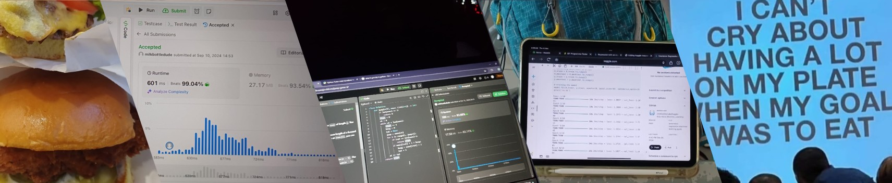

## Hello World! 👋

I practice machine learning on public datasets in my spare time :)

### 👨🏻‍💻 Usually, I work with:

### 🔭 Currently working on:
- [Johorscrape](https://github.com/milkbottledude/woodlands-jb_tracker), a fullstack webapp that uses machine learning to predict congestion patterns on the Woodlands-JB Causeway for users.

### 🌱 Right now I'm learning:

### 🤔 I’m looking for help with:
- automating of training image data annotation for [Johorscrape](https://github.com/milkbottledude/woodlands-jb_tracker) using YOLO

### 📫 How to reach me:

  

### ⚡ Fun fact:
- I'm a certified SAF lifeguard! 🛟🦺

<!--
**milkbottledude/milkbottledude** is a ✨ _special_ ✨ repository because its `README.md` (this file) appears on your GitHub profile.

Here are some ideas to get you started:

- 🔭 I’m currently working on ...
- 🌱 I’m currently learning ...
- 👯 I’m looking to collaborate on ...
- 🤔 I’m looking for help with ...
- 💬 Ask me about ...
- 📫 How to reach me: ...
- 😄 Pronouns: ...
- ⚡ Fun fact: ...
-->
