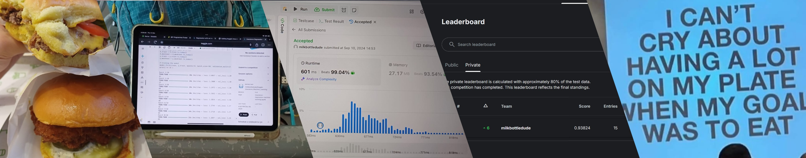

## Hello World! 👋

I practice machine learning on public datasets in my spare time :)

### 👨🏻‍💻 Usually, I work with:

### 🔭 Currently working on:
- [Fwen](https://github.com/milkbottledude/Fwen), a React Native apk app UI connected to a locally hosted (private) LLM AI model. Features include chatbot mode, agentic notetaking (cmg soon!), and an interactive alarm clock (cmg soon!).
- [BAISmods](https://github.com/milkbottledude/BAISmods), a fullstack [webapp](https://baismods.onrender.com/) for NUS BAIS students to plan their modules throughout all 8 semesters.

### 🌱 Right now I'm learning:

### 🤔 I’m looking for help with:
- Cloudflare and VPNs 😫

### 📫 How to reach me:

  

(it's an image hyperlink, you can click it)

### ⚡ Fun fact:
- I'm a certified SAF lifeguard! 🛟🦺

<!--
**milkbottledude/milkbottledude** is a ✨ _special_ ✨ repository because its `README.md` (this file) appears on your GitHub profile.

Here are some ideas to get you started:

- 🔭 I’m currently working on ...
- 🌱 I’m currently learning ...
- 👯 I’m looking to collaborate on ...
- 🤔 I’m looking for help with ...
- 💬 Ask me about ...
- 📫 How to reach me: ...
- 😄 Pronouns: ...
- ⚡ Fun fact: ...
-->
